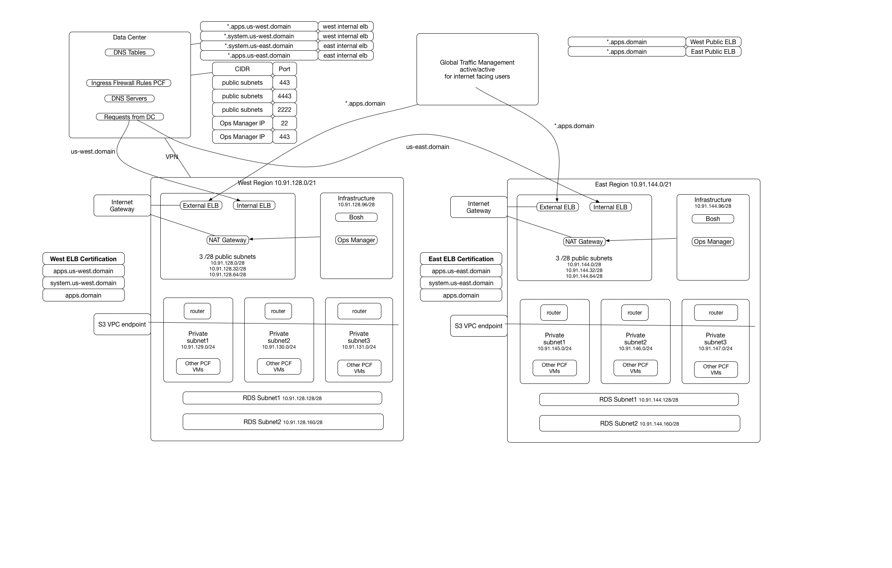

# Secured PCF AWS Cloud Formation Template

## Reality:
* Customers need to extend their internal network to the AWS env.
* Customers need to gain control and tight security on AWS env.
* ELB has no fixed IPs.
* ELB has to sit on all AZs which routers sit so it can load balance the traffic to all routers.
* Two separate cloud formation templates
  ```(Ops Manager and ER) seems overkill
  Currently ER template is calling Ops Manager template
  Ops Manager template has to be saved in the AWS S3 blobstore```

## Current Cloud formation issues:

* Hard code IP Blocks.
* ELB only sits on one subnet/AZ, can not load balance to another AZ/subnet.
* Internet facing ops manager.
* only two AZs.
* Private subnets has wide open internet access through NAT gateway.
* There is no internal ELB and network segmentation, hard to setup firewall rules from data center to AWS.

## Resolutions:

* Configurable subnets.
* Three private subnets across three AZs for CF deployment.
* Three small public subnets across three AZs where public ELB sits on.
* One internal ELB sits on public ELB without internet gateway attached.
* One small infrastructure subnet where bosh and Ops Manager sits on and only this subnet is able to route to internet through nat gateway. (Note: Ops Manager and Bosh need to contact EC2 endpoint, customer can choose to route through their data center as well instead of nat gateway)
* Private subnets are not able to route to internet.
* Private subnets connect to S3 through S3 VPC endpoint.
Combined two cloud formation templates to one.

* [CloudFormation template](pcf_1_7_cloudformation_singlefile.json)

* A multi region reference architecture
Note: Each CloudFormation template represents one region VPC deployment


